# 💬 KacipLuhh

> Bilik sembang sementara — kacip, settle, hilang. Tak payah buat group baru.


---

## 📖 Table of Contents

- [Overview](#-overview)
- [Features](#-features)
- [Tech Stack](#-tech-stack)
- [Architecture](#-architecture)
- [User Flow](#-user-flow)
- [Database / Storage](#-storage-redis)
- [API Structure](#-api-structure)
- [Frontend Components](#-frontend-components)
- [Feature Flows](#-feature-specific-flows)
- [Security & Privacy](#-security--privacy)
- [Getting Started](#-getting-started)
- [Environment Variables](#-environment-variables)
- [Project Structure](#-project-structure)
- [Roadmap](#-roadmap)
- [License](#-license)

---

## 🧭 Overview

KacipLuhh is a no-login, temporary web chat room built for quick, private group discussions that don't need to exist forever. Create a room, share the link, kacip dengan kawan-kawan, done — bilik hilang sendiri. No WhatsApp group needed. No accounts. No receipts.

Built for situations like: planning a surprise gift when the person is in your main group chat, quick team sync, throwaway discussion threads.

**Type:** `Solo`
**Brand:** `Luhh Series`
**Built with:** Independent

---

## ✨ Features

### Core
- ✅ Buat bilik dalam 10 saat — nama bilik sendiri, dapat link pendek terus
- ✅ Join tanpa akaun — pilih nickname, masuk terus
- ✅ Real-time chat dengan WebSocket (Socket.io)
- ✅ Tahu siapa online, siapa offline dalam bilik
- ✅ Bilik auto-delete — pilih 6, 12, 24, atau 48 jam
- ✅ Owner boleh extend masa bilik
- ✅ End-to-end encryption (E2EE) — server langsung tak boleh baca mesej (AES-256-GCM)
- ✅ Dual language UI — BM / EN dengan animated slide toggle
- ✅ Nickname persistent via localStorage token — tak perlu login semula
- ✅ Owner recovery link — owner identity survive tanpa akaun
- ✅ Zero message logging — tiada rekod, tiada jejak

### Chat
- ✅ Typing indicator — "Ahmad tengah taip..."
- ✅ Emoji reactions — 👍 ❤️ 😂 😮 😢 🎉 per message
- ✅ Reply to message — quote any message when replying
- ✅ Clickable links — URLs auto-detected and made clickable
- ✅ Poll dengan E2EE — buat poll dalam bilik, soalan & pilihan encrypted
- ✅ Scroll-to-bottom button — muncul bila scroll up

### Room Controls
- ✅ Room passcode — optional PIN sebelum boleh join
- ✅ Room accent colour — owner pilih warna tema bilik
- ✅ Capacity limit — owner set max users (2–50)
- ✅ Pin message — owner pin satu mesej, visible dekat top chat
- ✅ Owner can kick users — remove user by nickname
- ✅ System messages — "Ahmad joined / left / was removed"

### Notifications
- ✅ Sound notification toggle — soft ping on new message (🔔/🔕)
- ✅ Unread count in tab title — `(3) KacipLuhh`
- ✅ Browser push notification — bila tab hidden

### Operator
- ✅ Admin reports page `/admin` — view abuse reports, close rooms
- ✅ In-app Report Room — users report via modal, operator notified via webhook

### PWA
- ✅ Installable as app (manifest.json + meta tags)

### In Progress
- 🚧 Image attachment dalam chat
- 🚧 Mobile PWA full offline support

---

## 🛠 Tech Stack

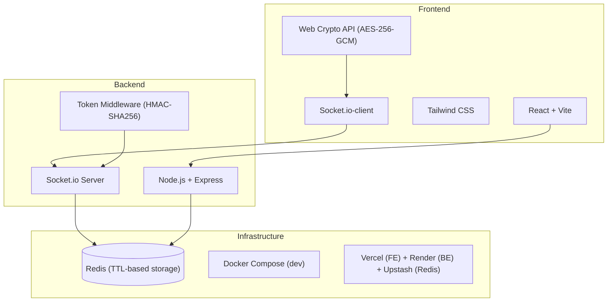

| Layer | Tech | Sebab |
|---|---|---|
| Frontend | React + Vite | Ringan, fast dev, no SSR needed untuk chat app |
| Styling | Tailwind CSS | Utility-first, senang maintain, consistent design |
| Real-time | Socket.io | Industry standard untuk WebSocket, handle reconnection auto |
| Encryption | Web Crypto API (AES-256-GCM) | Built-in browser API, E2EE tanpa library tambahan |
| Backend | Node.js + Express | Event-driven — perfect untuk WebSocket |
| Storage | Redis | Purpose-built untuk ephemeral data + TTL auto-expire |
| Dev | Docker Compose | Redis + backend + frontend dalam satu command |
| Hosting | Vercel + Render + Upstash | Free tier cukup untuk MVP |

---

## 📌 Architecture

### High-level Architecture

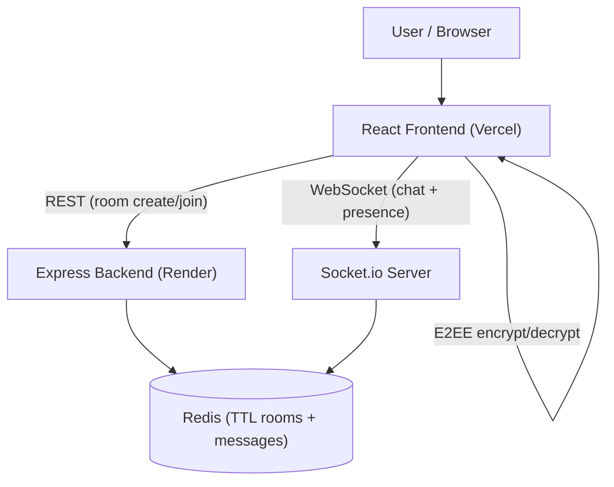

### System Architecture

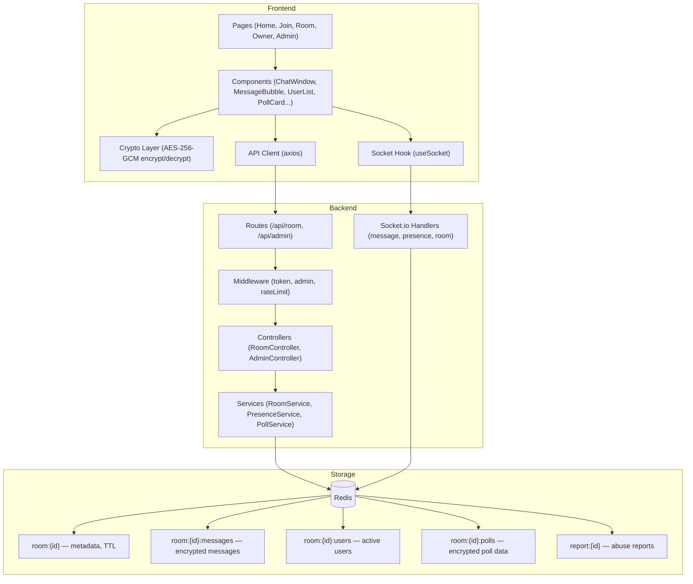

---

## 👤 User Flow

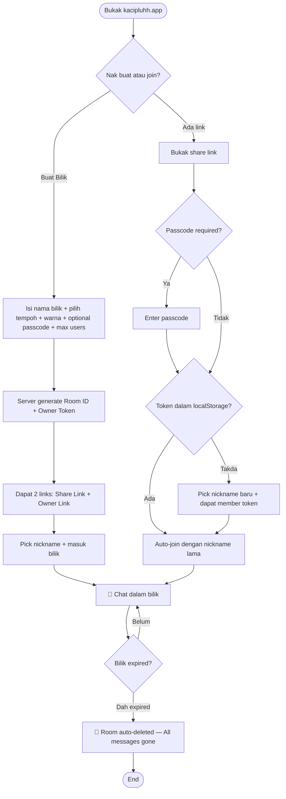

### Page Map

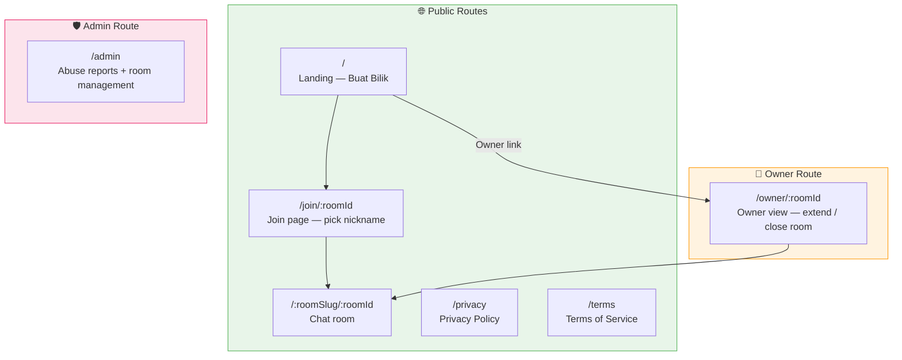

---

## 🗄️ Storage (Redis)

KacipLuhh guna **Redis** sebagai satu-satunya storage. Tiada SQL database. Tiada persistent storage. Semua data ada TTL — bila expired, hilang automatik.

| Key | Type | TTL | Purpose |
|---|---|---|---|
| `room:{id}` | Hash | sama dengan expiry bilik | Metadata bilik (nama, slug, status, accent colour, passcode hash, capacity, pinned msg) |
| `room:{id}:messages` | List | sama dengan expiry bilik | Senarai mesej (encrypted ciphertext + sender) |
| `room:{id}:users` | Hash | sama dengan expiry bilik | Active users + last ping |
| `room:{id}:polls` | Hash | sama dengan expiry bilik | Poll data (encrypted question/options + vote counts) |
| `report:{id}` | String | 7 hari | Abuse reports dari users |

> ⚠️ Semua key delete sendiri bila TTL habis. Tiada cron job diperlukan. Tiada manual cleanup.

---

## 🔌 API Structure

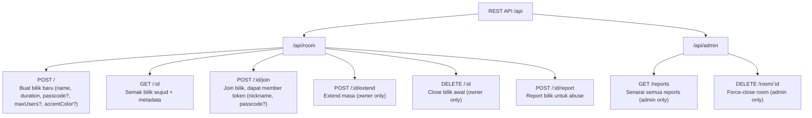

### WebSocket Events

| Event | Direction | Purpose |
|---|---|---|
| `room:join` | Client → Server | User masuk bilik |
| `room:leave` | Client → Server | User keluar bilik |
| `message:send` | Client → Server | Hantar mesej (encrypted) |
| `message:receive` | Server → Client | Terima mesej dari user lain |
| `message:history` | Client → Server | Request chat history |
| `message:pin` | Client → Server | Pin/unpin mesej (owner only) |
| `pin:update` | Server → Client | Broadcast pinned message ID |
| `presence:update` | Server → Client | Broadcast sapa online/offline |
| `system:message` | Server → Client | "Ahmad joined / left / was removed" |
| `ping` | Client → Server | Heartbeat tiap 10 saat |
| `room:expiring` | Server → Client | Warning bilik nak expire (≤10 min) |
| `room:deleted` | Server → Client | Notify semua user bilik dah delete |
| `typing:start` | Client → Server | User mula taip |
| `typing:stop` | Client → Server | User berhenti taip |
| `typing:update` | Server → Client | Broadcast siapa tengah taip |
| `reaction:toggle` | Client → Server | Toggle emoji reaction pada mesej |
| `reaction:update` | Server → Client | Broadcast reaction update |
| `poll:create` | Client → Server | Buat poll baru (encrypted) |
| `poll:vote` | Client → Server | Vote pada poll option |
| `poll:update` | Server → Client | Broadcast updated poll data |
| `poll:history` | Server → Client | All polls on room join |
| `user:kick` | Client → Server | Kick user by nickname (owner only) |
| `kicked` | Server → Client | Notify user yang kena kick |

---

## 🧩 Frontend Components

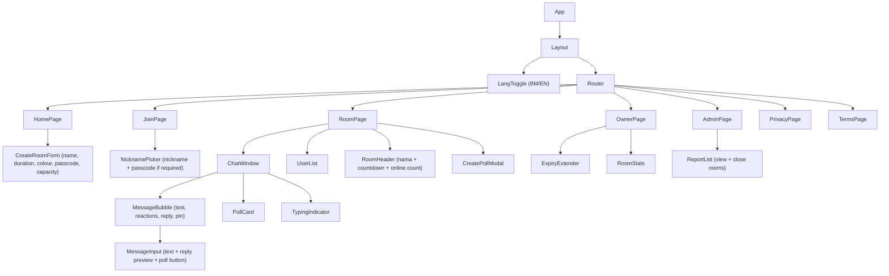

---

## ⚙️ Feature-specific Flows

### Room Creation Flow

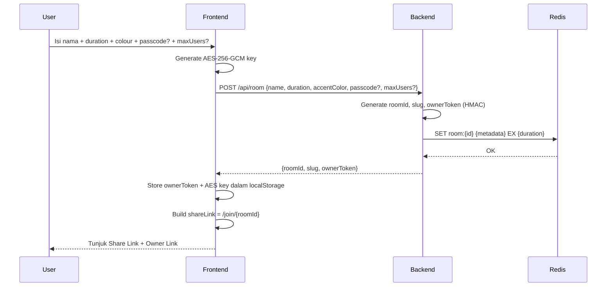

### Chat & E2EE Flow

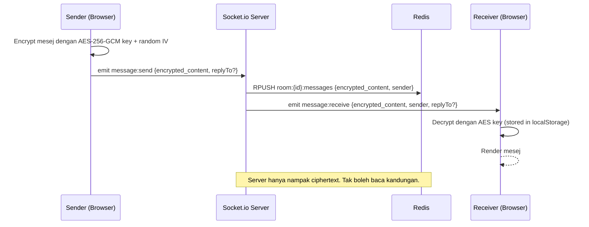

### Online/Offline Presence Flow

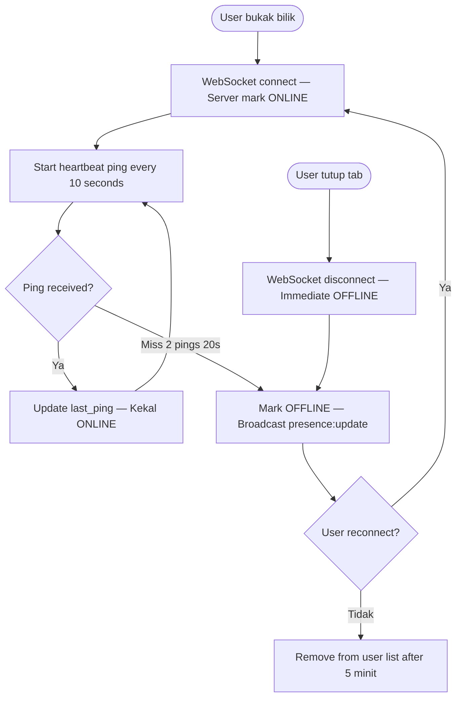

### Expiry & Extension Flow

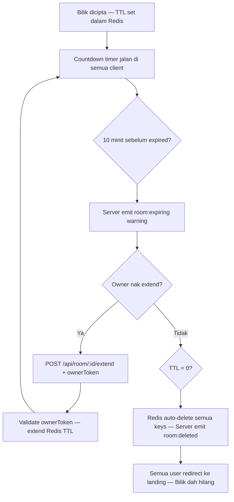

### Poll Flow (E2EE)

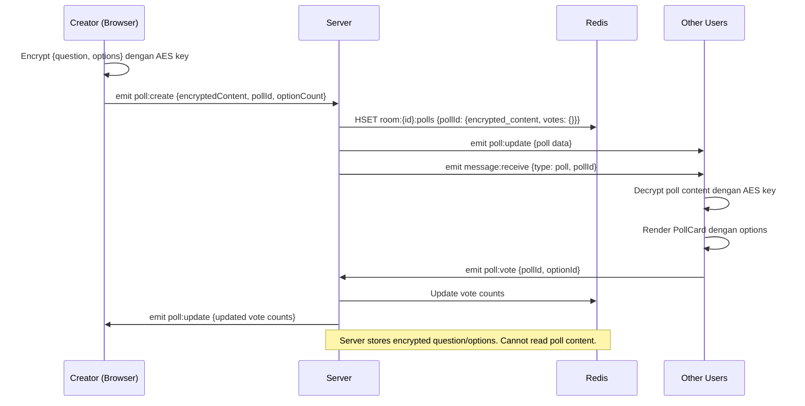

---

## 🔐 Security & Privacy

Ini bahagian paling kritikal untuk KacipLuhh — sebab value proposition utama dia adalah *privacy dan ephemeral*.

### Threat Model & Mitigations

| Ancaman | Mitigation |
|---|---|
| Server/database baca mesej | E2EE (AES-256-GCM) — server hanya simpan ciphertext |
| Database kena hack / leak | Semua data ada TTL max 48h, content encrypted, poll content encrypted |
| Man-in-the-middle intercept | WSS (WebSocket Secure) + HTTPS enforced |
| Session hijack / token forgery | HMAC-SHA256 signed tokens, timing-safe compare |
| Token reuse cross-room | Token payload contains roomId — validated on every event |
| Brute force room ID | Room ID = UUID (128-bit entropy) |
| Spam room creation | Rate limiting: 5 rooms per IP per hour |
| XSS → AES key stolen | Strict Content-Security-Policy via Helmet.js + vercel.json |
| Abuse / illegal content | In-app report → operator webhook → admin close room |
| Uninvited users | Optional room passcode (hashed with SHA-256 + TOKEN_SECRET) |

### E2EE Implementation

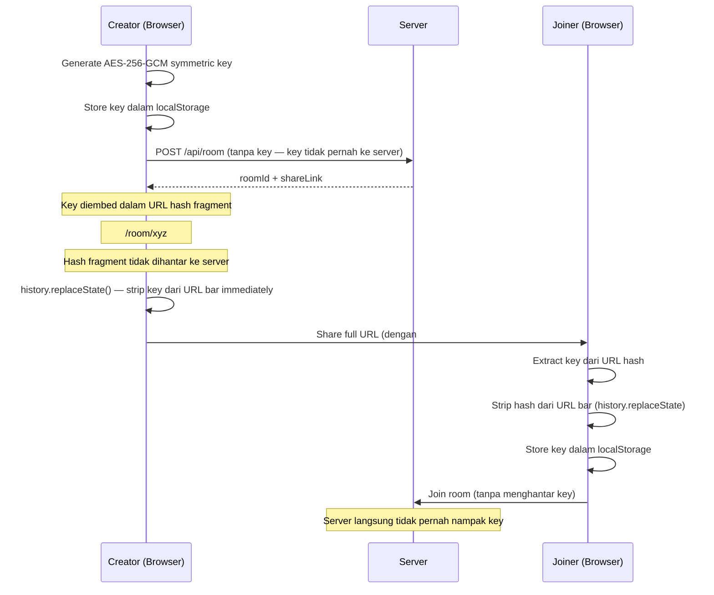

> **Key security decisions:**
> - AES-GCM (authenticated encryption) — detects tampering. NOT AES-CBC.
> - Each message uses a unique random IV — IV reuse would be catastrophic.
> - No plaintext fallback if encryption fails — fail closed.
> - E2EE key never in server logs, API responses, or socket payloads.
> - Poll question/options also encrypted — same AES key.

### Legal Protection

- **Zero-knowledge architecture** — secara teknikal mustahil untuk operator baca kandungan mesej atau poll
- **No logs** — tiada request logging untuk content mesej
- **Auto-delete** — data tidak wujud lebih dari 48 jam
- **Privacy Policy** at `/privacy` — covers PDPA 2010 (Malaysia) obligations
- **Terms of Service** at `/terms` — users agree to no illegal content
- **Abuse pipeline** — in-app report → Redis storage → webhook notify → admin close room

---

## 🚀 Getting Started

### Prerequisites

- Docker + Docker Compose (recommended)
- Node.js `>=20` (if running without Docker)

### Running with Docker (recommended)

```bash
# 1. Copy env files
cp backend/.env.example backend/.env
cp frontend/.env.example frontend/.env

# 2. Fill in backend/.env — generate secrets with:
# node -e "console.log(require('crypto').randomBytes(32).toString('hex'))"
# Set TOKEN_SECRET and ADMIN_SECRET

# 3. Start everything
docker compose up --build

# Next time (no dependency changes):
docker compose up
```

Open `http://localhost:5173`

### Running without Docker

```bash
# Terminal 1 — Redis
redis-server

# Terminal 2 — Backend
cd backend && npm install && npm run dev

# Terminal 3 — Frontend
cd frontend && npm install && npm run dev
```

### View Redis data (dev)

```bash
# Redis CLI inside Docker
docker compose exec redis redis-cli

KEYS *                              # semua keys
HGETALL room:<roomId>               # room metadata
LRANGE room:<roomId>:messages 0 -1  # messages (ciphertext)
TTL room:<roomId>                   # seconds until expire
HGETALL room:<roomId>:polls         # polls
KEYS report:*                       # abuse reports
```

---

## 🔑 Environment Variables

### Backend (`backend/.env`)

```env
PORT=3001
NODE_ENV=development

# Redis
REDIS_URL=redis://localhost:6379

# Secrets — generate with: node -e "console.log(require('crypto').randomBytes(32).toString('hex'))"
TOKEN_SECRET=change-me-generate-32-random-bytes
ADMIN_SECRET=change-me-generate-32-random-bytes-different

# CORS — exact frontend URL, no trailing slash
CORS_ORIGIN=http://localhost:5173

# Room limits
MAX_ROOM_DURATION_HOURS=48
MAX_MESSAGES_PER_ROOM=500

# Optional — Discord/Telegram webhook for abuse report notifications
# NOTIFY_WEBHOOK_URL=https://discord.com/api/webhooks/...
```

### Frontend (`frontend/.env`)

```env
VITE_API_URL=http://localhost:3001
VITE_WS_URL=http://localhost:3001
```

---

## 📁 Project Structure

```
kacipluhh/
├── docker-compose.yml
│
├── backend/
│   ├── Dockerfile
│   └── src/
│       ├── app.js              # Express app + Helmet CSP + CORS
│       ├── server.js           # HTTP server + Socket.io init
│       ├── controllers/
│       │   ├── room.controller.js
│       │   └── admin.controller.js
│       ├── services/
│       │   ├── room.service.js      # createRoom, joinRoom, extendRoom, pin, capacity
│       │   ├── presence.service.js  # markOnline, markOffline, updatePing
│       │   └── poll.service.js      # createPoll, votePoll, getPolls
│       ├── socket/
│       │   ├── index.js             # Socket.io init + auth middleware
│       │   └── handlers/
│       │       ├── message.js       # message:send, reactions, pin, polls
│       │       ├── presence.js      # ping, typing:start, typing:stop
│       │       └── room.js          # room:join, room:leave, kick, disconnect, system msgs
│       ├── routes/
│       │   ├── room.routes.js
│       │   └── admin.routes.js
│       ├── middleware/
│       │   ├── token.middleware.js  # HMAC token validation
│       │   ├── admin.middleware.js  # ADMIN_SECRET check
│       │   └── rateLimit.middleware.js
│       └── lib/
│           ├── redis.js
│           └── token.js            # generateToken, verifyToken (HMAC-SHA256)
│
└── frontend/
    ├── Dockerfile.dev
    ├── vercel.json             # CSP headers + SPA rewrites
    └── src/
        ├── pages/
        │   ├── HomePage.jsx    # Create room (name, duration, colour, passcode, capacity)
        │   ├── JoinPage.jsx    # Pick nickname + passcode entry
        │   ├── RoomPage.jsx    # Main chat room (all features wired)
        │   ├── OwnerPage.jsx   # Extend / close room
        │   ├── AdminPage.jsx   # View reports + force-close rooms
        │   ├── PrivacyPage.jsx
        │   └── TermsPage.jsx
        ├── components/
        │   ├── chat/
        │   │   ├── ChatWindow.jsx       # Messages + pinned banner + scroll btn
        │   │   ├── MessageBubble.jsx    # Bubble + reactions + reply + pin + links
        │   │   ├── MessageInput.jsx     # Text + reply preview + poll button + typing
        │   │   ├── TypingIndicator.jsx  # "Ahmad tengah taip..."
        │   │   ├── PollCard.jsx         # Poll display + voting UI
        │   │   └── CreatePollModal.jsx  # Poll creation form
        │   ├── room/
        │   │   ├── RoomHeader.jsx       # Nama + countdown + online toggle
        │   │   ├── UserList.jsx         # Online/offline + kick button
        │   │   └── ExpiryExtender.jsx   # +6h/12h/24h buttons
        │   └── ui/
        │       ├── Button.jsx
        │       ├── Input.jsx
        │       └── LangToggle.jsx       # Animated BM/EN toggle
        ├── hooks/
        │   ├── useSocket.js    # Ref-based callbacks (no stale closure), all events
        │   ├── useCrypto.js    # AES key init, encrypt, decrypt
        │   ├── useRoom.js      # Fetch room metadata
        │   └── usePresence.js  # User list state
        ├── lib/
        │   ├── api.js          # Axios REST calls
        │   ├── crypto.js       # AES-256-GCM encrypt/decrypt, generateRoomKey
        │   ├── token.js        # localStorage helpers (key, token, owner, nickname)
        │   ├── sound.js        # Web Audio API ping + toggle
        │   └── colors.js       # Accent colour constants + getAccentHex
        ├── i18n/
        │   ├── bm.js           # Bahasa Melayu strings
        │   ├── en.js           # English strings
        │   └── index.js        # t() helper
        └── context/
            └── LangContext.jsx # Language state + toggle
```

---

## 🗺 Roadmap

- [x] Core room creation + join flow
- [x] Real-time WebSocket chat
- [x] E2EE dengan AES-256-GCM
- [x] Presence (online/offline detection)
- [x] Auto-expiry + Redis TTL
- [x] Owner extend functionality
- [x] Dual language BM/EN
- [x] Room passcode (optional PIN)
- [x] Room accent colour
- [x] Capacity limit (max users)
- [x] Typing indicator
- [x] Emoji reactions per message
- [x] Reply to message (quote)
- [x] Poll dengan E2EE
- [x] Pin message (owner)
- [x] Kick user (owner)
- [x] System messages (join/leave/kick)
- [x] Sound notification toggle
- [x] Unread count in tab title
- [x] Browser push notifications
- [x] Scroll-to-bottom button
- [x] Clickable links in messages
- [x] Admin reports page
- [x] In-app report room
- [x] PWA manifest (installable)
- [x] Docker Compose dev setup
- [ ] Image attachment dalam chat
- [ ] Mobile PWA full offline support

---

## 📄 License

[MIT](LICENSE) © 2026 Luhh Series
