# 💬 KacipLuhh

> Bilik sembang sementara — kacip, settle, hilang. Tak payah buat group baru.


---

## 📖 Table of Contents

- [Overview](#-overview)
- [Features](#-features)
- [Tech Stack](#-tech-stack)
- [Architecture](#-architecture)
- [User Flow](#-user-flow)
- [Database / Storage](#-storage-redis)
- [API Structure](#-api-structure)
- [Frontend Components](#-frontend-components)
- [Feature Flows](#-feature-specific-flows)
- [Security & Privacy](#-security--privacy)
- [Getting Started](#-getting-started)
- [Environment Variables](#-environment-variables)
- [Project Structure](#-project-structure)
- [Roadmap](#-roadmap)
- [License](#-license)

---

## 🧭 Overview

KacipLuhh is a no-login, temporary web chat room built for quick, private group discussions that don't need to exist forever. Create a room, share the link, kacip dengan kawan-kawan, done — bilik hilang sendiri. No WhatsApp group needed. No accounts. No receipts.

Built for situations like: planning a surprise gift when the person is in your main group chat, quick team sync, throwaway discussion threads.

**Type:** `Solo`
**Brand:** `Luhh Series`
**Built with:** Independent

---

## ✨ Features

- ✅ Buat bilik dalam 10 saat — nama bilik sendiri, dapat link pendek terus
- ✅ Join tanpa akaun — pilih nickname, masuk terus
- ✅ Real-time chat dengan WebSocket (Socket.io)
- ✅ Tahu siapa online, siapa offline dalam bilik
- ✅ Bilik auto-delete — pilih 6, 12, 24, atau 48 jam
- ✅ Owner boleh extend masa bilik
- ✅ End-to-end encryption (E2EE) — server langsung tak boleh baca mesej
- ✅ Dual language UI — BM / EN dengan animated slide toggle
- ✅ Nickname persistent via localStorage token — tak perlu login semula
- ✅ Owner recovery link — owner identity survive tanpa akaun
- ✅ Zero message logging — tiada rekod, tiada jejak
- 🚧 Attach image dalam chat *(in progress)*
- 🚧 Poll / quick vote dalam bilik *(in progress)*

---

## 🛠 Tech Stack

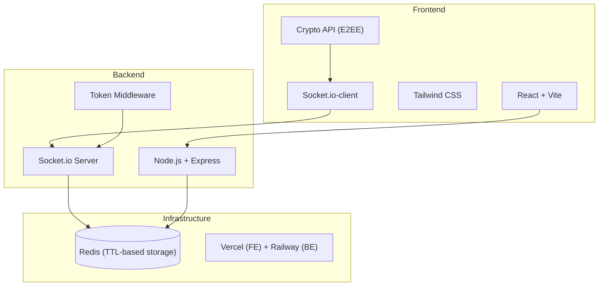

| Layer | Tech | Sebab |
|---|---|---|
| Frontend | React + Vite | Ringan, fast dev, no SSR needed untuk chat app |
| Styling | Tailwind CSS | Utility-first, senang maintain, consistent design |
| Real-time | Socket.io | Industry standard untuk WebSocket, handle reconnection auto |
| Encryption | Web Crypto API | Built-in browser API, E2EE tanpa library tambahan |
| Backend | Node.js + Express | Event-driven — perfect untuk WebSocket, same language as FE |
| Storage | Redis | Purpose-built untuk ephemeral data + TTL auto-expire |
| Hosting | Vercel + Railway | Free tier cukup untuk MVP, deploy semudah push to main |

---

## 📌 Architecture

### High-level Architecture

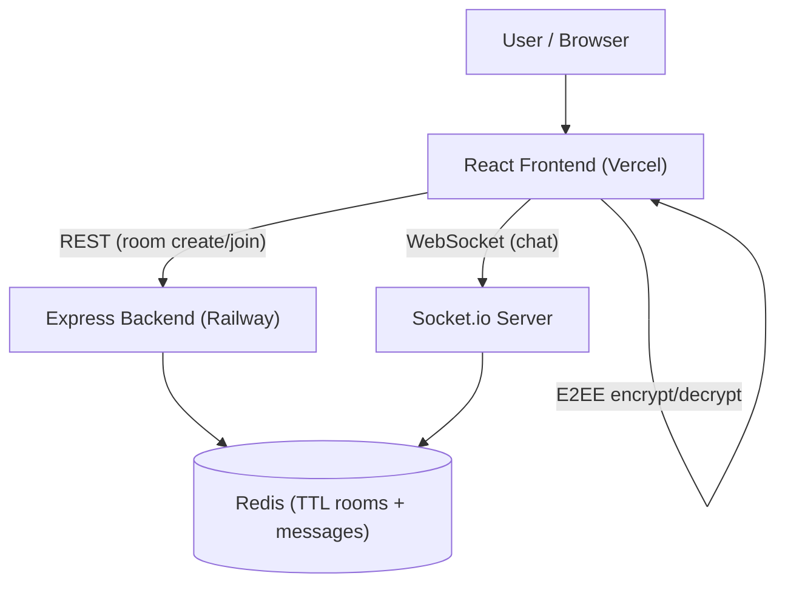

### System Architecture

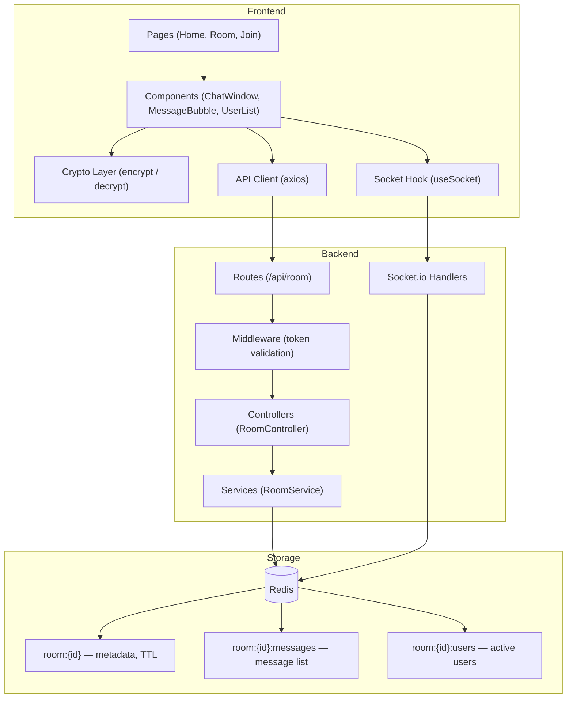

---

## 👤 User Flow

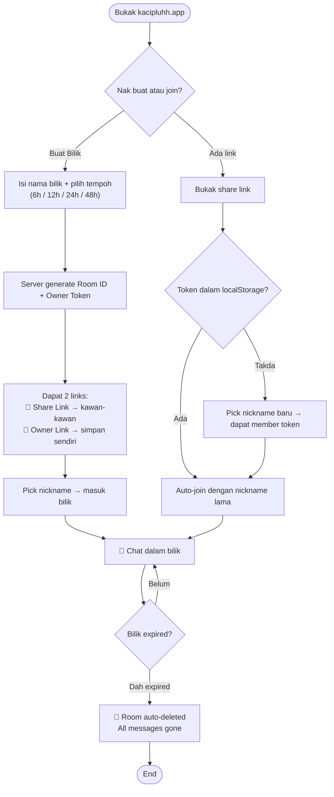

### Page Map

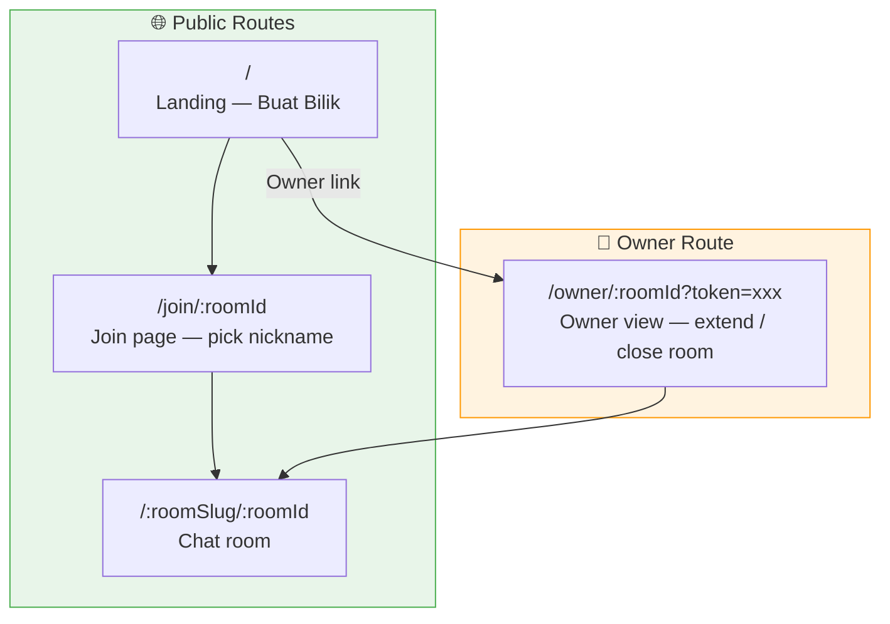

---

## 🗄️ Storage (Redis)

KacipLuhh guna **Redis** sebagai satu-satunya storage. Tiada SQL database. Tiada persistent storage. Semua data ada TTL — bila expired, hilang automatik.

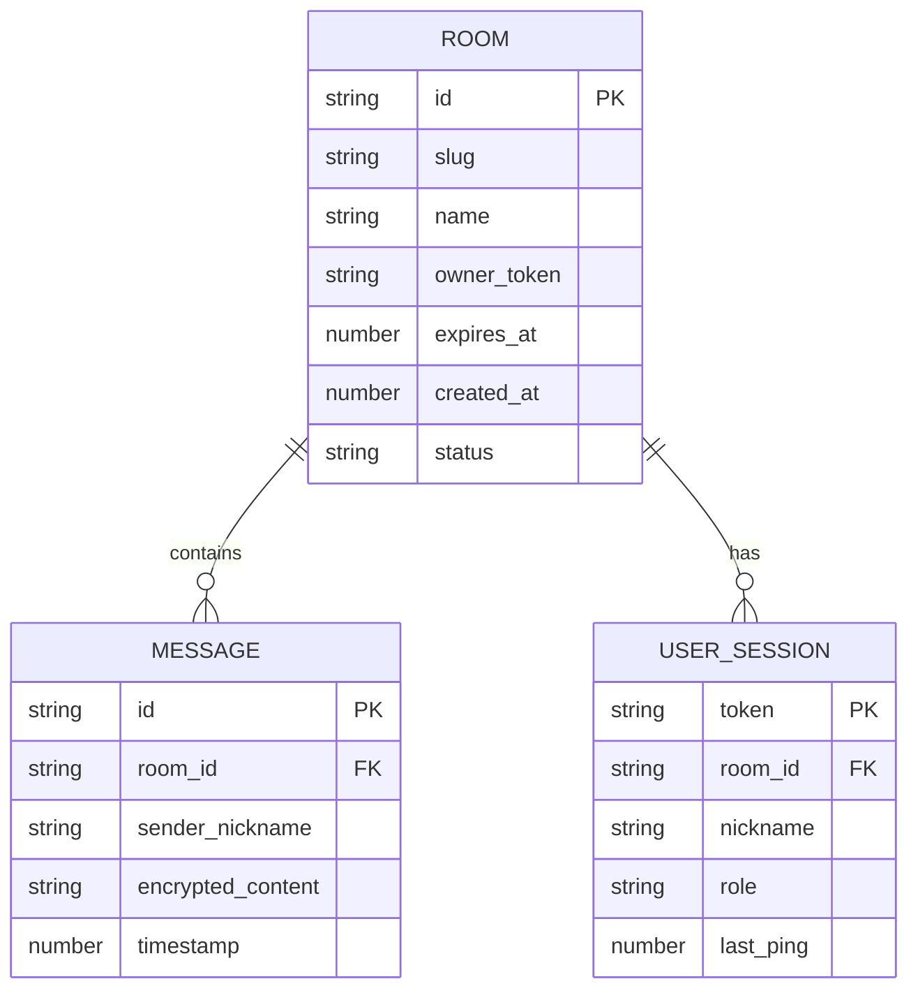

### Redis Key Structure

| Key | Type | TTL | Purpose |
|---|---|---|---|
| `room:{id}` | Hash | sama dengan expiry bilik | Metadata bilik |
| `room:{id}:messages` | List | sama dengan expiry bilik | Senarai mesej (encrypted) |
| `room:{id}:users` | Hash | sama dengan expiry bilik | Active users + last ping |
| `token:{token}` | Hash | 48h | Session token untuk nickname persistence |

> ⚠️ Semua key delete sendiri bila TTL habis. Tiada cron job diperlukan. Tiada manual cleanup.

---

## 🔌 API Structure

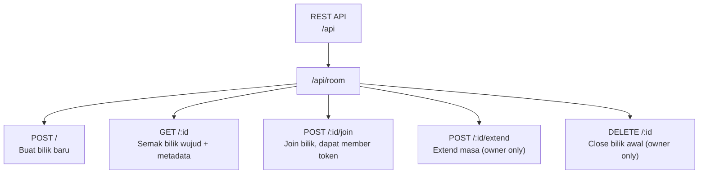

### WebSocket Events

| Event | Direction | Purpose |
|---|---|---|
| `room:join` | Client → Server | User masuk bilik |
| `room:leave` | Client → Server | User keluar bilik |
| `message:send` | Client → Server | Hantar mesej (encrypted) |
| `message:receive` | Server → Client | Terima mesej dari user lain |
| `presence:update` | Server → Client | Broadcast sapa online/offline |
| `ping` | Client → Server | Heartbeat tiap 10 saat |
| `room:expired` | Server → Client | Notify semua user bilik nak delete |

---

## 🧩 Frontend Components

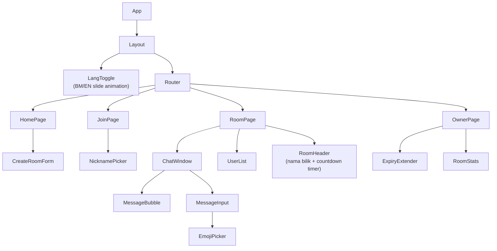

| Component | Purpose |
|---|---|
| `LangToggle` | Animated BM/EN slide toggle, persist pilihan dalam localStorage |
| `CreateRoomForm` | Nama bilik + pilih tempoh + generate links |
| `NicknamePicker` | Pick nama, semak duplicate dalam bilik |
| `ChatWindow` | Main chat area, render messages, auto-scroll |
| `MessageBubble` | Bubble mesej — own vs others, timestamp |
| `UserList` | Sidebar — tunjuk siapa online (hijau) dan offline (kelabu) |
| `RoomHeader` | Nama bilik + countdown timer live |
| `ExpiryExtender` | Owner extend masa bilik (tambah 6/12/24 jam) |

---

## ⚙️ Feature-specific Flows

### Room Creation Flow

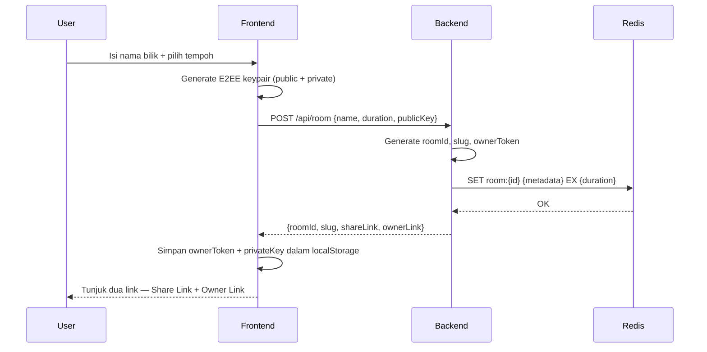

### Chat & E2EE Flow

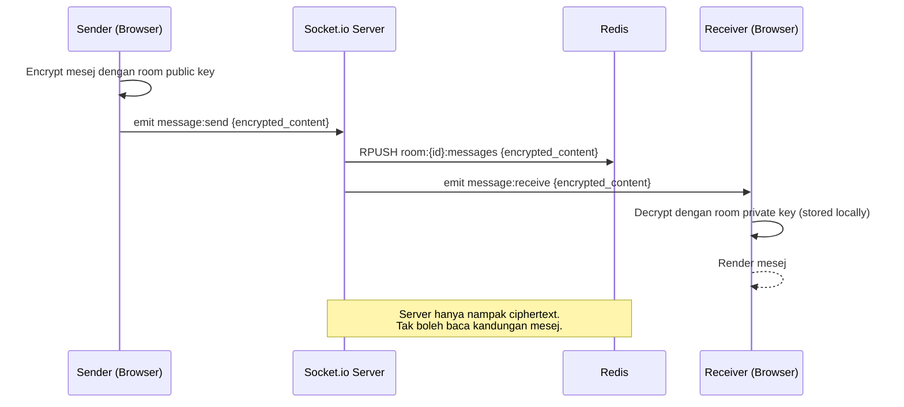

### Online/Offline Presence Flow

```mermaid
flowchart TD
    A([User bukak bilik]) --> B["WebSocket connect\nServer mark ONLINE"]
    B --> C["Start heartbeat ping\nevery 10 seconds"]
    C --> D{Ping received?}
    D -->|Ya| E["Update last_ping timestamp\nKekal ONLINE"]
    E --> C
    D -->|Miss 2 pings (20s)| F["Mark OFFLINE\nBroadcast presence:update"]
    F --> G{User reconnect?}
    G -->|Ya| B
    G -->|Tidak| H["Remove from user list\nafter 5 minit"]

    I([User tutup tab]) --> J["WebSocket disconnect event\nImmediate OFFLINE"]
    J --> F
```

### Expiry & Extension Flow

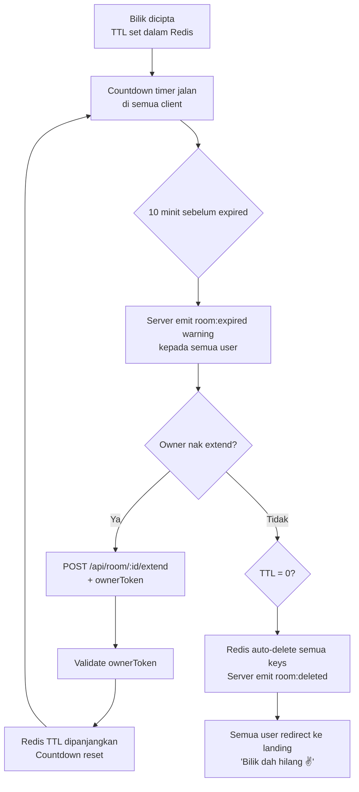

---

## 🔐 Security & Privacy

Ini bahagian paling kritikal untuk KacipLuhh — sebab value proposition utama dia adalah *privacy dan ephemeral*.

### Threat Model & Mitigations

| Ancaman | Mitigation |
|---|---|
| Owner server/database baca mesej | E2EE — server hanya simpan ciphertext |
| Database kena hack / leak | Semua data ada TTL, max 48h, content encrypted |
| Man-in-the-middle intercept | WSS (WebSocket Secure) + HTTPS enforced |
| Session hijack / impersonation | Token signed, tidak boleh forge |
| Brute force room ID | Room ID = UUID random (128-bit entropy) |
| User share link ke orang tak diundang | Room owner boleh close bilik manual |

### E2EE Implementation

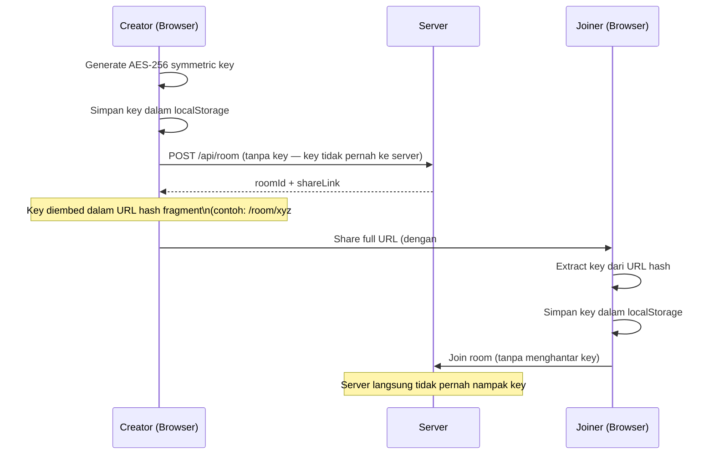

> **Key point:** URL hash fragment (`#`) tidak dihantar dalam HTTP request. Server tak pernah nampak encryption key. Ini adalah cara Signal dan ProtonMail buat E2EE dalam browser.

### Legal Protection (CYA)

- **Zero-knowledge architecture** — secara teknikal mustahil untuk operator baca kandungan mesej
- **No logs** — tiada request logging untuk content mesej
- **Auto-delete** — data tidak wujud lebih dari 48 jam
- **Terms of Service** wajib ada: users agree to no illegal content
- **No IP logging** untuk mesej (boleh log untuk abuse prevention sahaja)

---

## 🚀 Getting Started

### Prerequisites

- Node.js `>=18`
- Redis (local atau upstash.io untuk cloud)
- npm atau pnpm

### Installation

```bash
git clone https://github.com/[username]/kacipluhh.git
cd kacipluhh

# Install backend
cd backend && npm install

# Install frontend
cd ../frontend && npm install
```

### Running locally

```bash
# Terminal 1 — Redis (kalau guna local)
redis-server

# Terminal 2 — Backend
cd backend && npm run dev

# Terminal 3 — Frontend
cd frontend && npm run dev
```

---

## 🔑 Environment Variables

### Backend (`backend/.env`)

```env
PORT=3001
NODE_ENV=development

# Redis
REDIS_URL=redis://localhost:6379

# Security
TOKEN_SECRET=your-random-secret-here
CORS_ORIGIN=http://localhost:5173

# Room limits
MAX_ROOM_DURATION_HOURS=48
MAX_MESSAGES_PER_ROOM=500
```

### Frontend (`frontend/.env`)

```env
VITE_API_URL=http://localhost:3001
VITE_WS_URL=ws://localhost:3001
```

> Copy `.env.example` ke `.env` dan isi values.

---

## 📁 Project Structure

```
kacipluhh/
├── frontend/
│   └── src/
│       ├── components/
│       │   ├── chat/          # ChatWindow, MessageBubble, MessageInput
│       │   ├── room/          # RoomHeader, UserList, ExpiryExtender
│       │   └── ui/            # LangToggle, Button, Input (shared)
│       ├── pages/             # HomePage, JoinPage, RoomPage, OwnerPage
│       ├── hooks/             # useSocket, useRoom, useCrypto, usePresence
│       ├── lib/               # crypto.js, api.js, token.js
│       └── i18n/              # bm.js, en.js (translation strings)
│
└── backend/
    └── src/
        ├── routes/            # room.routes.js
        ├── controllers/       # room.controller.js
        ├── services/          # room.service.js, presence.service.js
        ├── socket/            # handlers/ (message, presence, room)
        ├── middleware/        # token.middleware.js
        └── lib/               # redis.js, token.js
```

> **Kenapa struktur ni?** Setiap folder ada satu tanggungjawab. `hooks/` untuk logic, `components/` untuk UI, `services/` untuk business logic, `lib/` untuk utilities. Bila project besar, kau tahu exactly mana nak cari apa.

---

## 🗺 Roadmap

- [x] Core room creation + join flow
- [x] Real-time WebSocket chat
- [x] E2EE dengan AES-256
- [x] Presence (online/offline detection)
- [x] Auto-expiry + Redis TTL
- [x] Owner extend functionality
- [x] Dual language BM/EN
- [ ] Image attachment dalam chat
- [ ] Quick poll / vote feature
- [ ] Room passcode (optional protection)
- [ ] Mobile PWA support

---

## 📄 License

[MIT](LICENSE) © 2025 Luhh Series
